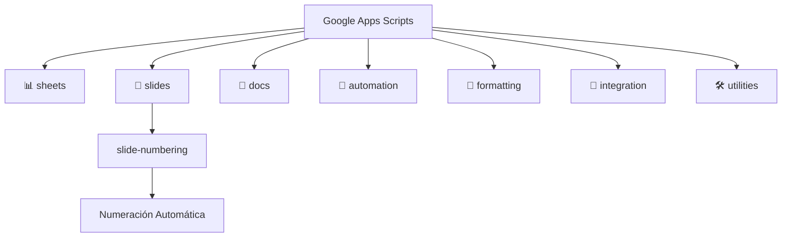

# 🤖 Google Apps Scripts Collection

Una colección personal de scripts útiles para automatizar y mejorar la productividad en Google Workspace (Google Apps), desarrollada en el contexto de la gestión documental y educativa en el ámbito sanitario.

## ⚕️ Contexto

Este repositorio surge de la necesidad personal de automatizar tareas repetitivas en el entorno médico-educativo, específicamente:

- Gestión de presentaciones docentes
- Automatización de documentación clínica
- Formateo de materiales educativos
- Herramientas para la docencia médica

## ⚠️ Descargo de Responsabilidad

- **Uso Personal**: Estos scripts han sido desarrollados para uso personal y educativo.
- **No Uso Clínico**: Estas herramientas NO están diseñadas ni deben utilizarse para la toma de decisiones clínicas.
- **Sin Garantía**: Se proporcionan "tal cual", sin garantía de ningún tipo, expresa o implícita.
- **Privacidad**: Al utilizar estos scripts, asegúrese de cumplir con las normativas de privacidad y protección de datos aplicables (GDPR, HIPAA, etc.).
- **Responsabilidad**: El usuario es responsable de verificar la idoneidad de estos scripts para su uso específico.

## 📋 Descripción

Este repositorio contiene scripts y herramientas para automatizar tareas en el ecosistema de Google Workspace:

- **Scripts de Presentaciones:** Automatización de Google Slides
- **Scripts de Hojas de Cálculo:** Mejoras para Google Sheets
- **Scripts de Documentos:** Utilidades para Google Docs
- **Herramientas de Automatización:** Scripts para tareas repetitivas
- **Utilidades de Formato:** Herramientas de formateo y estilo
- **Integraciones:** Conexiones entre aplicaciones de Google
- **Utilidades Generales:** Herramientas multipropósito

## 🗂️ Estructura del Repositorio

