# 🤖 Google Apps Scripts Collection

Una colección personal de scripts útiles para automatizar y mejorar la productividad en Google Workspace (Google Apps), desarrollada en el contexto de la gestión documental y educativa en el ámbito sanitario.

## ⚕️ Contexto

Este repositorio surge de la necesidad personal de automatizar tareas repetitivas en el entorno médico-educativo, específicamente:

- Gestión de presentaciones docentes
- Automatización de documentación clínica
- Formateo de materiales educativos
- Herramientas para la docencia médica

## ⚠️ Descargo de Responsabilidad

- **Uso Personal**: Estos scripts han sido desarrollados para uso personal y educativo.
- **No Uso Clínico**: Estas herramientas NO están diseñadas ni deben utilizarse para la toma de decisiones clínicas.
- **Sin Garantía**: Se proporcionan "tal cual", sin garantía de ningún tipo, expresa o implícita.
- **Privacidad**: Al utilizar estos scripts, asegúrese de cumplir con las normativas de privacidad y protección de datos aplicables (GDPR, HIPAA, etc.).
- **Responsabilidad**: El usuario es responsable de verificar la idoneidad de estos scripts para su uso específico.

## 📋 Descripción

Este repositorio contiene scripts y herramientas para automatizar tareas en el ecosistema de Google Workspace:

- **Scripts de Presentaciones:** Automatización de Google Slides
- **Scripts de Hojas de Cálculo:** Mejoras para Google Sheets
- **Scripts de Documentos:** Utilidades para Google Docs
- **Herramientas de Automatización:** Scripts para tareas repetitivas
- **Utilidades de Formato:** Herramientas de formateo y estilo
- **Integraciones:** Conexiones entre aplicaciones de Google
- **Utilidades Generales:** Herramientas multipropósito

## 🗂️ Estructura del Repositorio

```mermaid
graph TD;
    A[Google Apps Scripts] --> B[📊 sheets/];
    A --> C[📑 slides/];
    A --> D[📝 docs/];
    A --> E[🤖 automation/];
    A --> F[🎨 formatting/];
    A --> G[🔄 integration/];
    A --> H[🛠️ utilities/];

    C --> I[slide-numbering/]
    C --> J[link-extractor/]
    C --> K[code.gs]

    I --> L[Numeración Automática]
    J --> M[Extractor de Enlaces]
    K --> N[Menús Combinados]

    style C fill:#f9f,stroke:#333,stroke-width:2px
    style I fill:#bbf,stroke:#333,stroke-width:1px
    style J fill:#bbf,stroke:#333,stroke-width:1px
    style K fill:#bfb,stroke:#333,stroke-width:1px
```

## 📑 Utilidades de Presentaciones

### Numeración de Diapositivas

- 📝 Numeración automática en esquina inferior derecha
- 🔄 Actualización con un solo clic
- 👻 Salta diapositivas ocultas
- [Más información](slides/slide-numbering/README.md)

### Extractor de Enlaces

- 📊 Extracción de enlaces a hojas de cálculo
- 🔍 Detecta enlaces en textos, formas y tablas
- 📋 Formato automático de resultados
- [Más información](slides/link-extractor/README.md)

## 🤝 Contribuciones

Las contribuciones son bienvenidas. Por favor:

1. Revisa las guías de contribución específicas de cada módulo
2. Crea un issue para discutir cambios mayores
3. Asegúrate de mantener la estructura del repositorio

## 📄 Licencia

Este proyecto está bajo la Licencia MIT. Ver el archivo `LICENSE` para más detalles.
